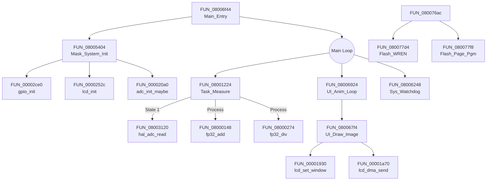

# XD0011_F.BIN Strict Reverese Engineering Analysis

**Date:** January 14, 2026
**Source Files:** `XD0011_F.BIN.c`, `XD0011_F.BIN.h`
**Methodology:** Strict code analysis of decompiled artifacts without external project reference.

## 1. Function Mapping & Analysis

The firmware appears to be a bare-metal application for an ARM Cortex-M0+ (likely N32G031 based on register usage) controlling a light meter with an LCD display and Flash storage.

### A. Math & Runtime Utilities (0x08000000 - 0x08000900)
These functions implement a **Software Floating Point Library** (IEEE 754) required because the CPU lacks a hardware FPU.

| Original Name | Renamed | Reasoning | Global Dependencies |
|---|---|---|---|
| `FUN_080000f4` | `uint32_div` | loops 0x20 times performing unsigned division | - |
| `FUN_08000148` | `fp32_add` | IEEE 754 single-precision addition (exponent mask 0xFF, implicit 1) | - |
| `FUN_080001ea` | `fp32_sub` | Wraps `fp32_add` with sign bit toggle (XOR 0x80000000) | - |
| `FUN_080001fa` | `fp32_mul` | Multiplies mantissas, adds exponents, subtracts bias (0x7F) | - |
| `FUN_08000274` | `fp32_div` | Float division loop (subtract divisor mantissa from dividend) | - |
| `FUN_0800043a` | `fp64_add` | Double-precision addition (11-bit exponent mask, `CONCAT44` logic) | `DAT_00000454` |
| `FUN_08000458` | `fp64_mul` | Double-precision multiplication with 16-bit word chunks | `DAT_00000524` |
| `FUN_08000528` | `fp64_div` | Double-precision long division | `DAT_00000614` |
| `FUN_08000698` | `fp32_to_fp64` | Converts single to double (expands bias 127 -> 1023) | - |
| `FUN_08000710` | `fp64_to_fp32` | Converts double to single (rounds mantissa, adjusts bias) | - |
| `FUN_08000904` | `__libc_init_array` | C runtime init Loop (calls function pointers in table) | `DAT_080095c0` - `DAT_080095e0` |

### B. Hardware Drivers (0x08000900 - 0x08005000)
Low-level control of MCU peripherals.

| Original Name | Renamed | Reasoning | Global Dependencies |
|---|---|---|---|
| `FUN_00002ce0` | `gpio_init` | Configures GPIO Mode/Speed/Pull registers. Base addr checks: `0x50000000` (GPIOA) | `PTR_GPIOA_00002eb8`, `PTR_GPIOB_00002ebc` |
| `FUN_0000252c` | `lcd_init` | Sends NV3029/ST7789 init cmds: `0xFF` (Ext), `0x3A` (Pixel), `0x11` (Sleep Out), `0x29` (Disp On) | `DAT_00002928` |
| `FUN_00001930` | `lcd_set_window` | Sends `0x2A` (Col Set) and `0x2B` (Row Set) via fast SPI | - |
| `FUN_000035a4` | `lcd_write_cmd` | Sets D/C Pin LOW via `FUN_00002ef8`, then writes byte | `DAT_000035c0` (GPIO Port) |
| `FUN_000035c4` | `lcd_write_data` | Sets D/C Pin HIGH via `FUN_00002efc`, then writes byte | - |
| `FUN_00003278` | `dma_start_tx` | Configures DMA Channel CMAR/CNDTR for bulk transfer | `DAT_00003338` (DMA Ch) |
| `FUN_00003524` | `spi1_set_dff` | Sets SPI CR1 bit 11 (DFF) for 8/16-bit switching | `PTR_SPI1_0000357c` |
| `FUN_00005d04` | `soft_spi_write` | Bit-banged SPI MOSI/CLK toggle (8 loops) | `PTR_GPIOA_00005d78` |
| `FUN_00004c80` | `soft_spi_read` | Bit-banged SPI MISO sample (8 loops) | `DAT_00004cc8` |
| `FUN_08003120` | `hal_adc_read` | Reads ADC results, likely oversampling loop | `DAT_08003140` |

### C. Application Logic & Flash (0x08005000 - End)
High-level application tasks and storage interaction.

| Original Name | Renamed | Reasoning | Global Dependencies |
|---|---|---|---|
| `FUN_08006f44` | `Main_Entry` | Entry point. Calls Init, then runs main event loop | `DAT_080070bc`, `DAT_080070d8` |
| `FUN_08001224` | `Task_Measure` | Sensor Data Acquisition state machine. State 0 (Wait) -> State 1 (Measure) | `DAT_080012c8` (State) |
| `FUN_080067f4` | `UI_Draw_Image` | High-level wrapper for drawing graphical assets | - |
| `FUN_08006924` | `UI_Anim_Loop` | Iterates images (Animation or Font rendering) | `DAT_0800698c` (Index) |
| `FUN_080077d4` | `Flash_WREN` | Sends SPI `0x06` (Write Enable) to external flash | `DAT_080077f4` |
| `FUN_080074b0` | `Flash_Erase_Sec`| Sends SPI `0x20` (Sector Erase) + Address | `DAT_080074f8` |
| `FUN_080077f8` | `Flash_Page_Pgm` | Sends SPI `0x02` (Page Program) + Data loop | `DAT_08007858` |
| `FUN_080075d0` | `Flash_Read` | Sends SPI `0x03` (Read Data) + Data loop | `DAT_08007628` |
| `FUN_08006248` | `Sys_Watchdog` | Periodically clears/resets watchdog timer | `DAT_080062c8` |

## 2. Execution Flow Graph

This graph illustrates the discovered call hierarchy using confirmed Original Names.

## 3. Global Variable Analysis (Partial)

*   `DAT_080012c8`: **Sensor State**. 0=Idle, 1=Measuring.
*   `DAT_080012cc`: **Timer Counter**. Incremented in Wait state.
*   `DAT_080062c8`: **Watchdog Register**. Accessed by `Sys_Watchdog`.
*   `PTR_SPI1_0000357c`: **SPI1 Base Pointer** (`0x40013000`).
*   `PTR_GPIOA_...`: **GPIO Port Pointers** (`0x50000000` et al).
